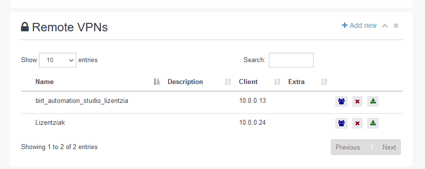
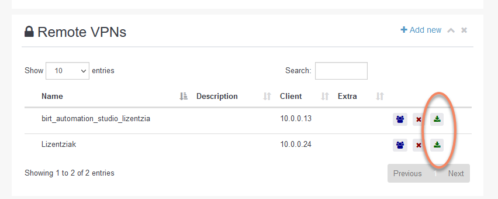

# Nola konektatu lizentziak FPCloudekin
Hurrengo manuala azaltzen da zelan konektatu lizentziak zerbitzari batetik

Domains-en barruan, Resources atalean

Remote VPNs izeneko atal batean, zerbitzariaren lizentzia konektatzeko VPN sortuko dugu

Baimena eman behar da, lizentzia horiek nork ikus ditzakeen ikusteko.

Horrez gain, mahaigain berri bat sortzen duzunean, gogoratu Networks "Default- Virtio" eta "Wireguard VPN"-ek hautatuta egon behar dutela.

Zerbitzarian, Wireguard instalatuko dugu, eta Resources-etik jaitsi dugun fitxategia erantsiko dugu.

Fitxategia deskargatu

Wireguard instalatuta dugu zerbitzarian

Gehitu tunela sakatuko dugu

Fitxategia inportatu dugu

Sakatu Aktibatu eta lizentziak ikusi beharko lirateke

Softwarea instalatzean, VPN IParena (10.0.0.24 eman diguna) eman behar zaio, ez lizentzia-zerbitzariarena.

