# IsardVDI - Moodle integrazioa

Ikasle gehienek bere moduloetan prestatuak dituzten mahagain birtualak bakarrik erabili behar dituzte. Hau da, ez dute IsardVDI ematen dizkigun beste aukerak erabili behar: mahaigain birtualaren ezaugarriak (RAM, CPU,sareak,...) modifikatu, ISOak igo, instalazioak , txantiloiak, etab.

Kasu hauetarako, moodlen erabiltzaile bakoitzak modulo bakoitzean erabili behar duen VDI lasterbide bat nola konfiguratu dezakegun azalduko dugu.

## Konfigurazioa: Moodle

1. Moodlen honako pluginak instalatu:

- FilterCodes: [https://moodle.org/plugins/filter_filtercodes](https://moodle.org/plugins/filter_filtercodes)

- Customfield_file: [https://github.com/andrewhancox/moodle-customfield_file](https://github.com/andrewhancox/moodle-customfield_file)

2. IsardVDI fitxategiekin lana egiteko plugin-en egokitzapena:

- filtercodes [filter.php](./files-moodle/filter.php) fitxategia modifikatu, //MUA artean dagoena gehitu

- customfield [lib.php](./files-moodle/lib.php) fitxategia modifikatu, //MUA artean dagoena gehitu

3. Site Administration--->Manage Filters, FilterCodes ON jarri behar da (Manage Filters irudia ikusi). Ezarpenak ez dira ikutu.

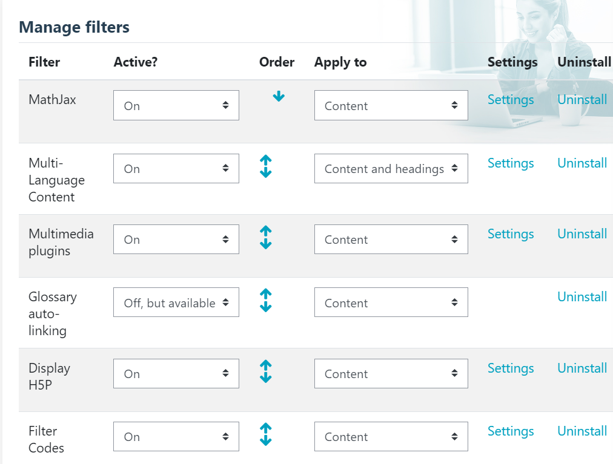

4. Site Administration --->Courses-->Course custom fields atalean File motako "vdi_estekak" eremua sortuko dugu:

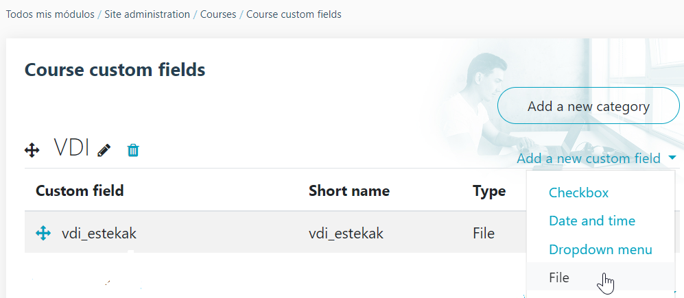

5. Kurtsoan eremu pertsonalizatu bat gehitzen denean, ikastaroko fitxan agertu ez dadin, irudian agertzen den css kodea gehitu behar da:

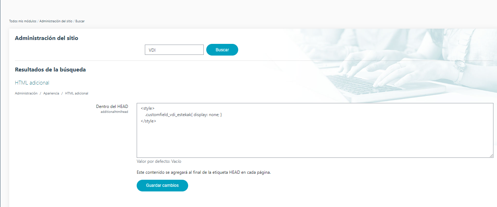

6. VDIen loturak publikatu nahi diren ikastaroetan Etiketa motako jarduera bat gehitu. Editatu ta Testu editorean html kodea gehitu da eta FilterCode Tags hau erabiliko da:  ```{profile_field_shortname}```

HTML kodea adibidea:

```html
<div class="info-box">

<h4><span style="font-size: 1.5rem;">Escritorio Virtual:</span></h4>

<div class="remember-box">

<p>{course_field_vdi_estekak}</p>

</div>

</div>
```

Erabiltzaileek horrela ikusiko lukete:


Sakatzerakoan honakoa ikusiko lukete:

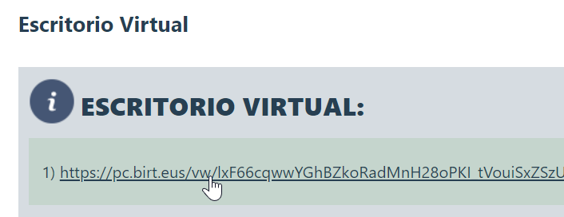

Bertan sakatu ezkero, nabigatzailean VDI-an gaitutak dauden bisoreen botoioak ikusiko genituzke, adibidez:

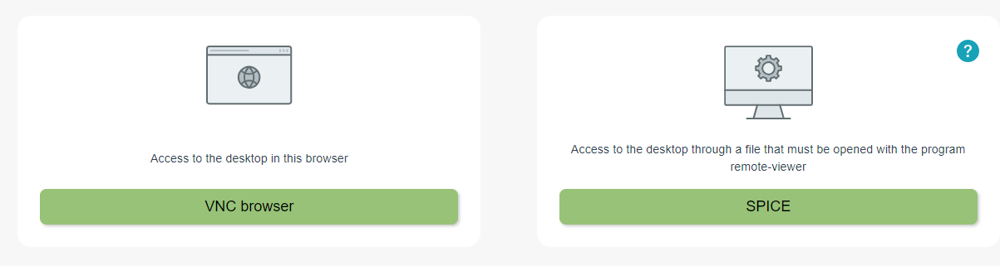


## Erabilera: VDIak IsardVDI-tik Moodle-era.

Garrantzitsua: Isard eta moodle erabiltzaileek email berdina konfiguratua izatea beharrezkoa da, erabiltzaile bakoitzari erakutsiko dion VDI esteka erabakitzeko hori erabiliko du eta.

Hedapen (deploy) batean sartuko gara, horretarako Deployments atalean sartu:

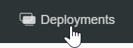

Bat aukeratu eta bistaratua dagoela konprobatuko degu,  bestela bistaratu:

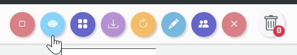

Hurrengo urratsa VDIen estaka fitxategia jeistea da, horretarako hemen sakatuko dugu:

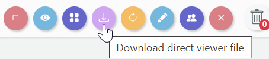

Bertan URL-ak berritu edo mantendu nahi ditugun galdetuko digu, kasu honetan mantenduko ditugu:

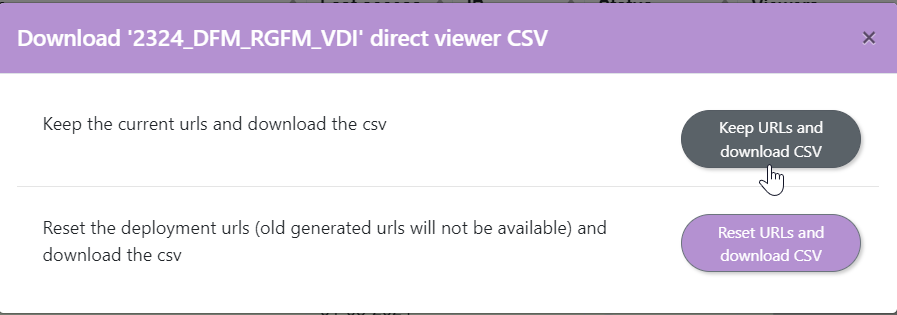

CSV motako fitxategi bat deskargatuko digu.


**Moodle-en:**

Dagokion ikastaroan sartu-> Editar curso->Editar Ajustes:

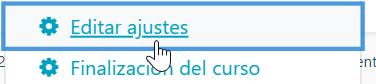

Moodle-en dena ondo konfiguratuta baldin badugu VDI atalean:

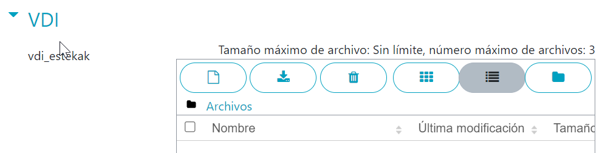

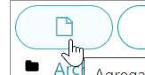

Aldaketak gorde:

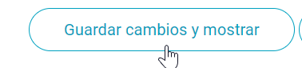

Ta konprobatzeko lehen sortu dugun etiketan sartzen bagara:


VDI-aren esteka ikusi beharko genuke


Laborategi baterako VDI bat baino gehiago erabili nahi baditugu, VDI bakoitzeko Deploy bat egingo degu eta bere CSV fitxategia jetsi eta moodlere igo. Horrela ikasleek esteka bat baino gehiago izango dituzte.

Eskerrak eman pluginak egokitu dituen Mikel Urkiaga (Poke) lankideari!!!.
