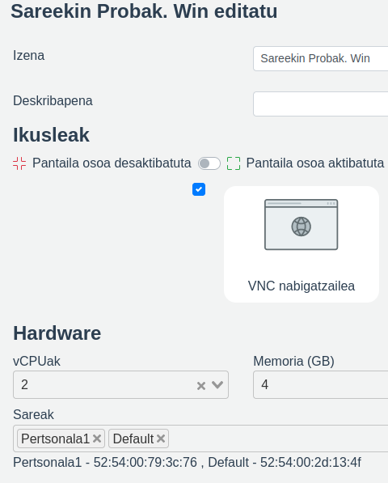
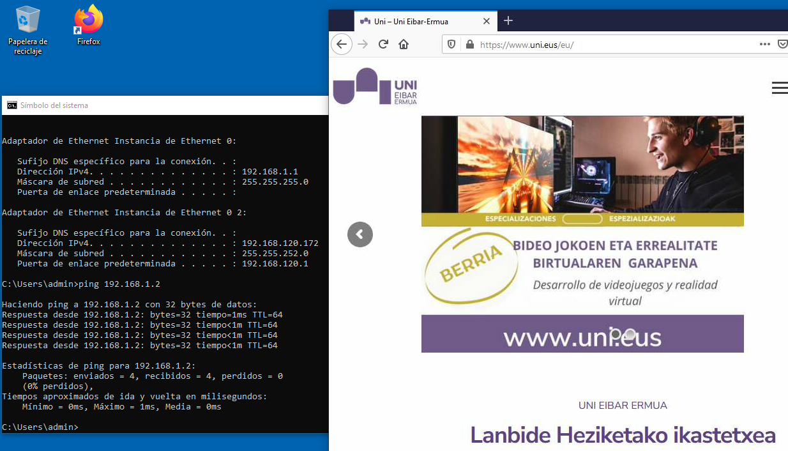
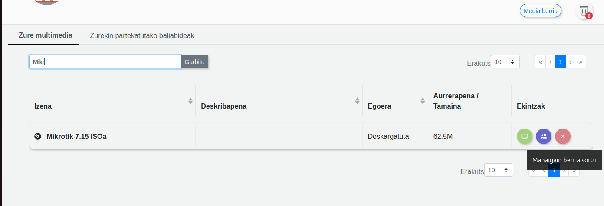
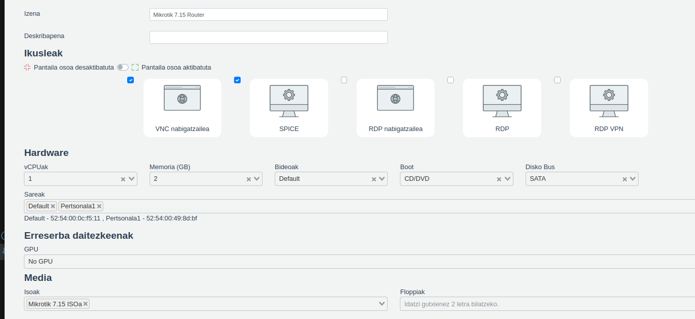
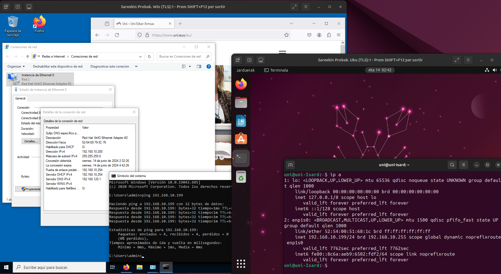

# Sareak Isarden
Gida honen helburua ez da Isardeko sareei buruzko manual bat sortzea, Isarden sareekin egin daitezkeen zenbait kasu praktiko lantzea baizik. Ondorioz hasieran sareei buruzko oinarrizko informazio bat emango da, beti ere aurrerago erabiliko dugunerantz fokua jarrita edo jada gure ikastetxean duguna azalduz baina ez [sareei buruzko dokumentazio ofizial (Isarden)](https://isard.gitlab.io/isardvdi-docs/user/networks/) gisa. Dokumentazio ona da eta edozein zalantzatarako bertara jo.

## Oinarrizko kontzeptuak
Isarden 4 sare mota nagusi ditugu:
- **Default** sarea: Internetera sarbide automatikoa duen BAKARRA. DHCP bitartez jasotzen ditu IP eta atebidea eta sare isolatu bezala, zuzen zuzenean irtetzen da.
- **OpenVSwitch sareak**. Hauek dira gehien erabiliko ditugun sareak Isarden. Isardeko sare ohikoen gisa jo ditzakegu. Switch bat izatea bezala da non bertara konektatzen den guztia lotuta egongo den eta erabiltzaile ezberdinen artean parteka dezakeguna. Adibidez guk, gelako, honako sare bat dugu, non bertako ikasle eta irakasleek mahaigainak ipin ditzaketen. Mahaigai horiek ez lukete ez IPrik, ez internetera irteerarik... Norbere esku konfiguratzea.
- **Infrastructure sareak**. Non gure gela fisikoak, Isardekoekin lotzen ditugun. Bertan ezarritako egozein gailu gelatik atzitu ahal izango da. Gure gela fisiko bakoitza, Isarden dugu bertan ere "jolasteko" aukerak izateko. Sare hauetan, gelako konfigurazioak ipinita Internetera irtetzea izango dugu
- **Pertsonalak**. Sare pertsonalak, norberarenak eta isolatuak. Bertan jarritako mahaigainak, soilik norbere mahaigainekin konektatu ahal izango dira. Ezin dira partekatu. Guk 1-3 sare pertsonal esleitzen dizkiogu ikasle bakoitzari
- **WireGuard-VPN sareak**. Sare hauen helburua, erabiltzen zauden ordenagailu fisikoa eta Isardeko mahaigaina konektatzen dituen sare bat sortzea da. Erabilpen ezberdin (eta interesgarri) asko ditu, RDP bisoreetarako behar izatetik, etxeko ordenagailua Isardekoarekin (edo ikastetxeko montajearekin) bat egiteko aukerak. (5. sare mota honen erabilpen kasuak egitea ez da puntu hontan gure helburua)


Sareen kudeaketarako administrari gisa Isarden sartzean, Administrazioa --> Domains --> Resources (1. irudia):


Ikus dezakezuen bezala, sare pila bat ditugu Isarden, 100 inguru, beraz irudian ikus daitekeen sare identifikadoreekin ez nahasteko **dokumentu bat dugu**.
Puntu hontan IKT sailaren bilera bat derrigorra da beharrezkoak izango ditugun sareak identifikatzeko, aurrerago ere gehitu ahal izango diren arren. 
Sareak gure ikastetxean: 
- ikasleko 1-3 (eta 5 irakasleko) sare Pertsonal ditugu
- gela arruntetan 2 sare, bata gelako fisikoarekin lotuta (*"Infrastructure vlan"* sarea) eta bestea gelako birtuala izango dena.
- horrez gain Ethaziko erronka bitartez sareekin lanean ari diren geletan beste 3-5 sare gelako ethazi talde bakoitzeko
- Zikloko sarea (1. eta 2. mailako ikasleek ikusiko luketena)
- Irakasleentzako sarea
- Default sarea, berez txantilloi gehienetaz izaten dena eta Internetera sarbibea ematen dizuna
- ...


## Sareak sortzen
Adibide bat erabiliko dugu koka gaitezen: aurreko 1. irudiko "add new" edo sare bati egokitutako "arkatz" ikonoak klikatuz, hau genuke: (2. irudia)

<!--  -->


Hor ikusten denez, sarearen izena ASIR2-T11 da eta gela hortako erronketako lehen taldearen lehen sarea da. OpenVSwitch motakoa da eta gure barne dokumentazioaren arabera 2632 vlan IDa dauka
QoS gisa, komenigarria da, beti,mugaren bat jartzen.

Hurrengo pausoa, sarea nork ikus dezakeen erabakia da, horretarako 1. irudiko "jendetsa" ikonoa klikatuz (3. irudia).
<!--  -->


Hemen, esandako sarea esleitzen dugu, erabiltzaileka, kategoriaka, taldeka... Kasuan, SISA-2 taldeak eta InforIrakas taldeek bakarrik ikusiko dute.

```
Orainartekoa Administrariaren lana da. Hemendik aurrera (sareen erabilpena) edozen erabiltzailek egin ahal izango du.
```


## Ordenagailuak konektatzen ##
### 01-. Bi ekipo interneterantz ###
Edozein bi ekipo sortu eta Internetera konektatzeko modurik errazena **Default** sarea erabiliz egitea da.
Beraz, frontendeko pantailatik Mahaigain berria klikatu. (4. irudia)

<!--  -->


Eta ondoren txantiloi bat erabiliz (guk asko ditugu eta nik T3 idatziz bilaketa bat egin dut) bat aukeratu. (5. irudia) 
<!--  -->


**Aukera aurreratuak** klikatuta daukat eta bertan bisoreez gain, mahaigain honek lehenetsita dituen ezaugarria ikusten dira. Orain gure gustora eraldatu ditzakegu.
Ariketa hontarako behakaldean doi-doi ikusten den *Sareak* atala eta *Default* (aukeratutakoa) dira garrantzitsuak.

Sareak atala desplegatuz erabiltzaileak ikus ditzakeen sareen zerrenda agertuko da. (6. irudia)

<!--  -->


Ariketa hontarako, esan bezala, ***Default*** sarea bakarrik erabiliko da.

Ordenaigailu bat badugu. Orain bigarren bat egingo dugu, pausu berdinak jarraituz. Nire kasuan Ubuntu txantiloi bat aukeratu dut Windows-Linux sare ariketa egiten hasteko. Baina bigarren mahaigaina Windows bat aukeratuz ere berdin berdin joango da.
Sortze fase hontako bukaeran 2 mahaigain izango ditugu. (5.irudia)

<!--  -->


> Mahaigainak duen "..." (hiru puntu) ikonotxoa klikatu eta ondoren arkatza aukeratuz--> **zuzendu/editatu** --> berriro mahaigaina editatu dezakegu. Fija zaitezte **Sareak** atalean eta nola **Default** dugun aukeratuta. Eta justu azpian? Default sare hortara konektatuko den sare txartelaren **MAC zenbakia**!

<!-- >  -->
> 


Pantaila nagusira bueltatuz, piztu ditzagun gure 2 mahaigainak ***HASI*** klikatuz.

Hurrengo irudian (09) bi ordenagailuak ikus ditzakegu, piztuta eta Internet dutelarik.
<!--  -->

Windowsaren IPa 192.168.121.87/22 da, eta ubuntuarena 192.168.121.124/22
Sare berdinean al daude? Ping egin al dezakete?
Itxura baten, IPak eremu berdinean eta "**Default**" sarean daude biak eta guztia dago ondo baina...

**EZ. EZ DAUDE SARE BERDINEAN, EZ DUTE PING EGITEN.** (ikusi 10. irudia)
<!--  -->


>Zergatia erraza da, hasierako azalpenean komentatu den bezala, Isardeko sare motek funtzio ezberdinak dituzte eta Default sareak internetera sarbidea ematen du, baina ekipo bakoitza bere sare isolatu propioan kokatuz. Bakoitzaren IP konkretuak berdin dio, isolatuak daude.

Zer egin dezakegu elkarri ping egin diezaioten? goazen zenbait aukera ikustera

### 02-. Bi ekipok elkarri ping egin

Aurreko ariketa garatzen jarraituko dugu.
Dakigunakin, nola lor dezakegu bi ekipoek elkar ping egin dezaten?

***Default*** ez den beste sare batera konektatuz.

Sare "***orokorrak***" (OpenVSwich sareak, ikusi [Oinarrizko kontzeptuak puntua](#oinarrizko-kontzeptuak)) erabiliko ditugu erabiltzaileen ezberdinen mahaigainen arteko **ping**/konexioak egiteko eta sare ***Pertsonalak*** norberaren sareetan ibiltzeko (besteei trabarik egin gabe, laborategi propio eta isolatuak sortuz).

Kasu honetan, Pertsonala sareak erabiliko ditugu, ondorioz ikasle guztiek batera egin dezakete ariketa hau, -IP berdinak ipinita eta elkar ikusi gabe-, bakoitzaren mahaigainak bere esparruaren barruan geldituko baitira. Eta ikasle desberdinen mahaigainek ez dute elkar joko/ikusiko.

Beraz, esandakoa, bide erraza dugu. Mahaigainak gelditu, zuzendu/editatu, sareak **Pertsonala1**ean jarri **Default**en ordez eta ondoren mahaigainak berriz piztu. 

Lehenik zuzendu/editatu (ikusi 11. irudia)


<!--  -->


Desaukeratu Default (ikusi 12. irudia)

<!--  -->


Pertsonala1 aukeratu eta aldaketak onartu.(ikusi 13. irudia)

<!--  -->


Eta mahaigainak abiarazi
>Pertsonala1 sarean (Default ez, beste guztietan), ez dugu IPrik jasotzen, beraz guk eskuz jarri beharko ditugu!

192.168.1.1/24 eta 192.168.1.2/24 ip-ak jarriko dizkiegu.
Eta jada hasi gara "arazotxoaz" konturatzen. Zein izango dute atebidea? Atebiderik gabe ez dute interneterik!

Ez dute Internetik izango.
Ikusi 14. irudian, nola ping bai baina ez dugun internetik, ez DNSrik...

<!--  -->


Ezin al dute bi mahaigainek elkar ikusi eta Internet izan?

### 03-. Bi ekipok elkarri ping egin eta Internetera konexioa izan.

Badaude zenbait modu hau lortzeko, errazenetatik, logikoenetara (sareen ikuspuntutik). Goazen aukera pare bat ikustera.

#### 03.01-. Bi sare txartel erabiliz

Dakigunarekin, (**Default** sare txartelak Internet ematen digula eta **Pertsonala1**ek aldiz, elkar lotzeko (ping) aukera ematen digula), zergatik ez ditugu 2 txartelak erabiltzen?

Goazen hortara orduan.

Bi mahaigainak editatuko ditugu 11. irudian ikusi dugun bezala eta unean dugun sareari (14. irudian ikus daitekeen) **Pertsonala1**, **Default** sarea GEHITUKO diogu. Ikusi 15. irudia

<!--  -->


Aldaketak onartu eta abiaraz ditzagun bi mahaigainak.

>Kasuan bi ordenagailuek bina sare txartel izango dituzte, bi IP...

Abiaraztean ([aurreko ariketa](#02--bi-ekipok-elkarri-ping-egin) jarraitzen ari bagara), jada gure bi txartelek IPak izango dituzte:

Lehena, **Pertsonala1**ena da. Eskuz jarri dugu eta editatzerakoan "ikutu" ez badugu, aurretik emandako IPa mantenduko du.
Bestea berriz, **Default** sarearena da, eta honek DHCP bitartez automatikoki jasotzen duenez, IPa jasota izango dugu jada.

Ikusi 16.irudia (nire Windowseko ekipoa hartu dut), bertan bi IPak ikusten dira:
- 192.168.1.1 (aurretik eskuz jarria eta bi mahaigainek elkar ping egin dezaten ahalbidetzen duena) eta 

- 192.168.120.172 (DHCP bitartez jaso duena eta Internet emango diguna).

<!--  -->


Atzekaldean, Interneten nabigatzen gaudela ere ikusten da.

> Oraindik sare gutxi ditugu, baina baliteke gehiago izatean, sare txartelen ordena garbi ez izatea; horretarako, beraiek duten MACean fijatu gaitezke. Batetik sistema eragiletik MACa hartu eta bestetik mahaigaina editatu eta sare txartelaren azpikaldean duenarekin konparatu, zein dan zein, jakiteko eta bakoitza zer saretara konektatua dagoen.

Bukatzeko, ikusten denez, honek funtzionatzen du, baina ez da ohikoa izaten ordenagailuek 2 sare txartel izatea (edo hiru?). Nola egingo genuke 2. sare Pertsonal bat ere bagenu? Edo gehiagorekin?

Informatikan, sareekin jolasteko **ROUTER**rak erabiltzen ditugu!


#### 03.02-. Sareak router bidez konektatuz

Router edo bideratzaileak erabiltzera bagoaz, lehenik beraiek sisteman instalatu beharko ditugu.
Ez da manual txiki honen helburua instalazioetaz hitzegitea baina hona hemen azalpen txiki batzuk:

Lehenik instalatu behar dugunaren ISOa aurkitu beharko dugu. Gurean Mikrotiken webgunera joan gara (https://mikrotik.com/download)[https://mikrotik.com/download]eta bertatik **RouterOSv7**ko **X86** ataleko **CD image** deskargatu dugu. Zuzenean linka nahi duzuenontzat: https://download.mikrotik.com/routeros/7.15.1/mikrotik-7.15.1.iso
Horrek ISOa jeitsiko du.

Isard-en Menu nagusian, Media, Media Berria klikatuz: (ikusi 17. irudia)
<!--  -->


Kasuan Mikrotik ISOa Mikrotiken webetik zuzenean Isardera pasako dugu. Eta ondoren sortuko den ISOa "Inform. Irakas" eta "IKT Mintegia" taldeek soilik ikusi-erabili ahalko dute.

Ondoren klikatu Mahaigain berria sortu eta mahaigain berri bat sortzeko pantailara joango gara, baina oraingoaz RouterMahaigaina izango da.
Router bat izatera ez dugu ez vCPU, ez memoria, ez disko askorik beharko. Sortzera goazenez **Boot** CD/DVD aukeratuko dugu eta ondoren sareak.
Zer saretan izango ditu hankak router honek? Bitan, **Default** sarean interneta hartzeko eta **Pertsonala1**ean ekipoak ikutzeko.(Ikusi18. irudia)

<!--  -->


Guztia onartu eta mahaigain-Routerra sortuko da.
Ondoren sortutako MahaigainRouter hori abiarazi (cd-tik abiatu eta instalazioa has dezan). Instalazioa burutu, Mahaigaina itzali, BERRIZ EDITATU/ZUZENDU eta **Boot** Hard Disk aukeratuko dugu, diskotik piztu dadin eta ez ISOtik, bestela denbora guztian geundekelako instalatzen!
 
 Beraz jada badugu router bat gure sistemarako!

>Gurean RouterMahaingain hau txantiloi bihurtu dugu eta orain guztiok erabil dezakegu router gisa instalatu beharrik gabe.

Jarraitu aurretik (aurreko ariketak egiten ibili zeratenontzat) mahaiganak editatuko ditugu eta berriz jarriko ditugu sare txartel bakarrarekin: Default sarea kendu eta Pertsonala1 bakarrik utzi.


Jada baditugu tresna guztiak, goazen bukatzera!

Lehenik Routerra piztu eta ondoren mahaigain biak.
Routerra konfiguratu beharrean egon gaitezke zenbait kasutan baina oraingoan ez dugu ezer egin behar. Soilik piztu eta bere Pertsonala1 hankatik IPak DHCP bitartez banatzen hasiko da.
Ondoren PCak piztu eta sarearen konfigurazio ezarpenetan, aurretik jarri diogun IP estatiko kendu eta DHCP bitartez eska dezaiola jarriko diogu.
Guztia onartu eta jada badugu internet. Routerra bere lana egiten ari da!

Azken irudian, 19.ean nire routerrak 192.168.10.199/24 eta 192.168.10.200 IPak banatu dizkit eta beraien arteko ping-a ikusten da. 

>Mikrotik-ek orokorren konfiguratu ezean, lehen aldian 192.168.88.0/24 IPan banatzen dituzte

<!--  -->

